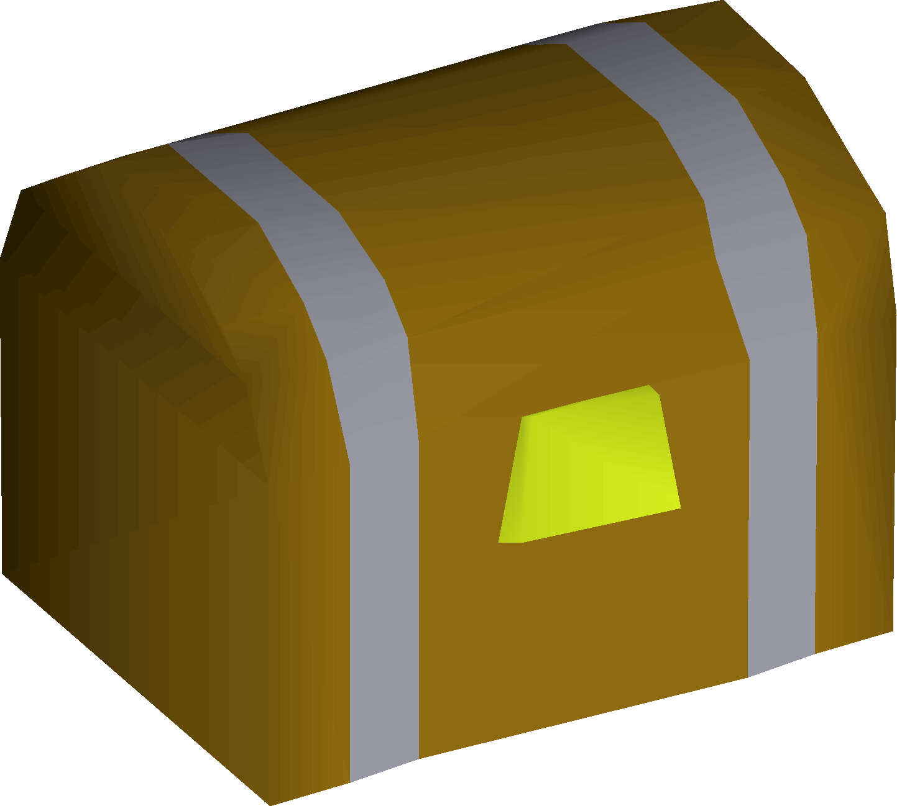

# Clue Scroll Tags & Gear

- [Item Tags](#item-tags)
- [Gear Tags](#gear-tags)
- [FAQ](#faq)
- [Notes](#notes)

## Item Tags

All clue tiers **except beginner and master** have unique item IDs for each clue step

This allows us to provide hints on the clue scroll item without requiring players to open the clue

### How To

Requires the [Custom Item Tags](https://runelite.net/plugin-hub/show/custom-item-tags) RuneLite plugin

Paste the contents of the tag files into the *Custom Tags* section of of the plugin configuration

- Multiple sets of tags can be used at once, simply paste the next set of tags on a new line

You should now see a tag on your current clue

### Links

    

        
         
        <a href="Easy/Easy%20Clue%20Tags.yml">Easy</a>
    

    

        
         
        <a href="Medium/Medium%20Clue%20Tags.yml">Medium</a>
    

    

        
         
        <a href="Hard/Hard%20Clue%20Tags.yml">Hard</a>
    

    

        
         
        <a href="Elite/Elite%20Clue%20Tags.yml">Elite</a>
    

## Gear Tags

### How To

Requires the [Bank tag layouts](https://runelite.net/plugin-hub/show/bank-tag-layouts) RuneLite plugin

To import, right click the *New tag tab* button and select *Import tag tab with layout*

You should now see a new tag tab

### Links

    

        
         
        <a href="Beginner/Gear/README.md">Beginner</a>
    

    

        
         
        <a href="Easy/Gear/README.md">Easy</a>
    

    

        
         
        <a href="Medium/Gear/README.md">Medium</a>
    

    

        
         
        <a href="Hard/Gear/README.md">Hard</a>
    

    

        
         
        <a href="Elite/Gear/README.md">Elite</a>
    

        

        
         
        <a href="Master/Gear/README.md">Master</a>
    

    

        
         
        <a href="Mimic/Gear/README.md">Mimic</a>
    

## FAQ

1. What do some of these shorthand names mean?

| Shorthand | Explanation                      |
| --------- | -------------------------------- |
| +         | Bank first                       |
| -         | Degear for wildy                 |
| GLIDE     | Seed pod&rarr;climb up to glider |
| RESP      | Respawn: set to Edgeville        |
| FISH      | Max Cape&rarr;Fishing Teleports  |
| OTHER     | Max Cape&rarr;Other Teleports    |
| GVS       | Goblin village sphere            |
| BOX       | POH jewellery box                |

2. Which teleports are for Ancient Magicks?

| Shorthand | Explanation           |
| --------- | --------------------- |
| PADD      | Paddewwa Teleport     |
| SENN      | Senntisten Teleport   |
| KHAR      | Kharyrll Teleport     |
| LASS      | Lassar Teleport       |
| CARR      | Carrallanger Teleport |
| ANNA      | Annakarl Teleport     |
| GHOR      | Ghorrock Teleport     |

## Notes

Work in progress
