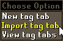
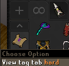

# Bank Tags

Bank Tag Layouts and screenshots of recommended gear setups for all clues

## How To

Requires the [Bank Tag Layouts](https://runelite.net/plugin-hub/show/bank-tag-layouts) RuneLite plugin

To import:

- Copy contents of one of the provided bank tags to your clipboard
- Right click the *New tag tab* button
- Select *Import tag tab with layout*

You should now see a new tag tab

## Tags

    <a href="beginner">
        

            
            Beginner
        

    </a>
    <a href="easy">
        

            
            Easy
        

    </a>
    <a href="medium">
        

            
            Medium
        

    </a>
    <a href="hard">
        

            
            Hard
        

    </a>
    <a href="elite">
         

           
            Elite
        

    </a>
    <a href="master">
        

            
            Master
        

    </a>
    <a href="mimic">
        

            
            Mimic
        

    </a>

