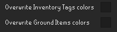

{{ title("Clue Details", "Clue_scroll_(Song_of_the_Elves)_detail") }}

The Clue Details plugin allows us to provide custom overlays for clue scrolls

1. Easy, Medium, Hard, and Elite details are shown automatically
    - These clues have unique item IDs for each clue step
2. Beginner and Master details <u>require the clue to be opened once</u>

## How To

1. Requires the [Clue Details](https://runelite.net/plugin-hub/show/clue-details) RuneLite plugin
2. Import Clue Details
    1. Options:
        1. Copy contents of one of the provided clue details lists to your clipboard (see *Tags* below)
        2. If you have tags in the *Custom Item Tags* format, please use the <a href="converter">converter</a>
    2. Prior to importing, if you would like to overwrite your existing Inventory Tag colors, or Ground Items colors, enable the related options in the plugin configuration shown below
        - _Color Legend_: Beginner Easy Medium Hard Hard Uri Elite Elite Challenge Master Wilderness
        - 
    3. Click the Import button the top of the sidebar panel
        - 
3. In the plugin configuration, select *Show clue tags*
    - 
4. You should now see a tag with the clue description for clues in your inventory
    - 

## Tags

    {{ index_link('beginner') }}
    {{ index_link('easy') }}
    {{ index_link('medium') }}
    {{ index_link('hard') }}
    {{ index_link('elite') }}
    {{ index_link('master') }}

