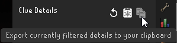
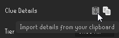

{{ title("Widgets Converter", "Transportation_logo") }}

This tool provides conversion for widget highlights, typically when game updates cause highlighting of unintended widgets.

## How To
**NOTE: It is highly recommended to save a backup of your Clue Details after step 1 in case you make a mistake when converting**

1. Click the Export button the top of the sidebar panel
    - 
2. Paste your Clue Details into the first box below
3. Copy a mapping from the approptiate tab below, and paste into the second box

    _Copy button is provided on the right_

    === "March 11 Spellbook"
        ``` title=""
        --8<-- "docs/details/converters/widgets/mar-11-spellbook.txt"
        ```
    === "Music removal"
        ``` title=""
        --8<-- "docs/details/converters/widgets/music-removal.txt"
        ```
    === "April 1 Spellbook"
        ``` title=""
        --8<-- "docs/details/converters/widgets/apr-1-spellbook.txt"
        ```
    === "April 15 Spellbook"
        ``` title=""
        --8<-- "docs/details/converters/widgets/apr-15-spellbook.txt"
        ```
    - You may also generate/provide your own custom mappings

4. Click the Convert button
5. Click the Copy button
6. Click the Import button the top of the sidebar panel
    - 

<textarea id="details-before" class="equipment textarea" placeholder="Paste Clue Details Here">
</textarea>

<textarea id="mapping-file" class="equipment textarea" placeholder="Paste mapping here">
</textarea>

<div class="tooltip">
    <button id="convert" class="equipment">
        <span id="convertTooltip" class="tooltiptext">Convert</span>
        Convert
    </button>
</div>

<textarea id="details-after" class="equipment textarea" placeholder="Clue Details Output Here">
</textarea>

<div class="tooltip">
    <button id="copy" class="equipment">
        <span id="copyTooltip" class="tooltiptext">Copy to clipboard</span>
        Copy
    </button>
</div>
