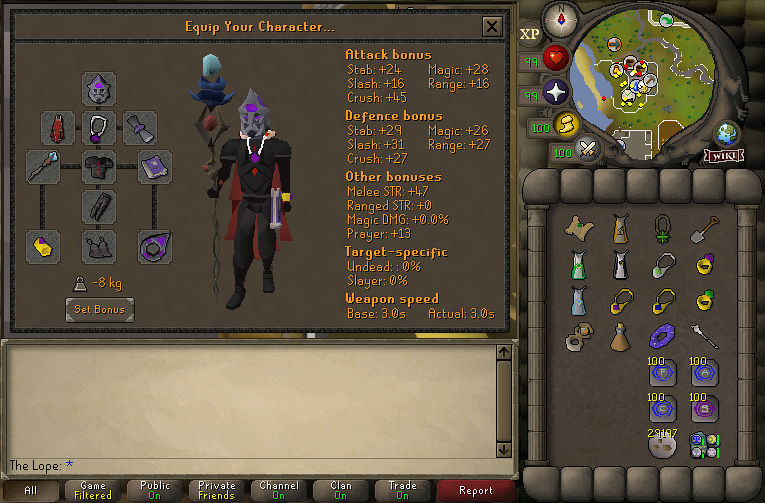
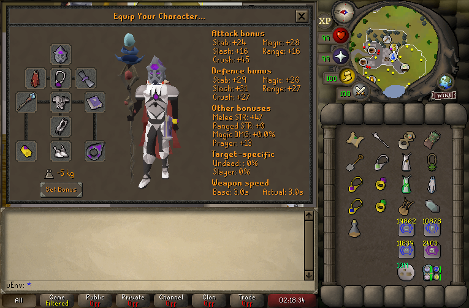

#  Easy Gear Tags



_Copy button is provided on the right_
``` json title=""
--8<-- "Easy/Gear/Easy Gear Tags.txt"
```

## Easy Ents Gear Tags



_Copy button is provided on the right_
``` json title=""
--8<-- "Easy/Gear/Easy Ents Gear Tags.txt"
```