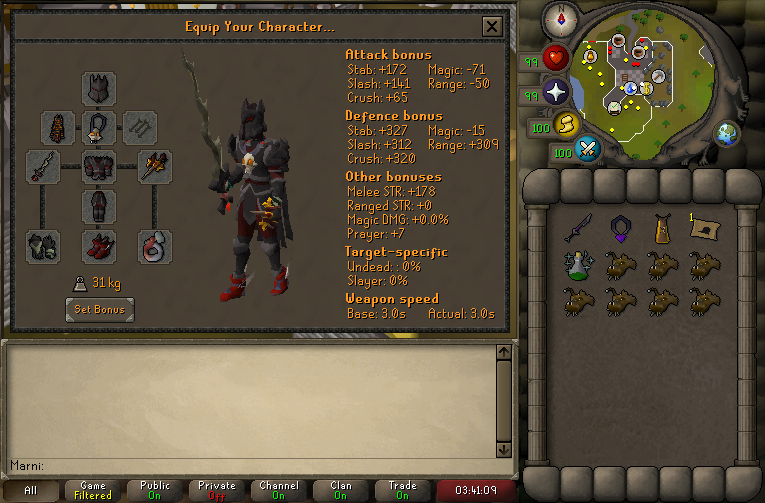

#  Mimic Gear Tags



_Copy button is provided on the right_
``` json title=""
--8<-- "Mimic/Gear/Mimic Gear Tags.txt"
```

## Notes
- Important not to die or teleport out, otherwise it removes rolls of the clue casket