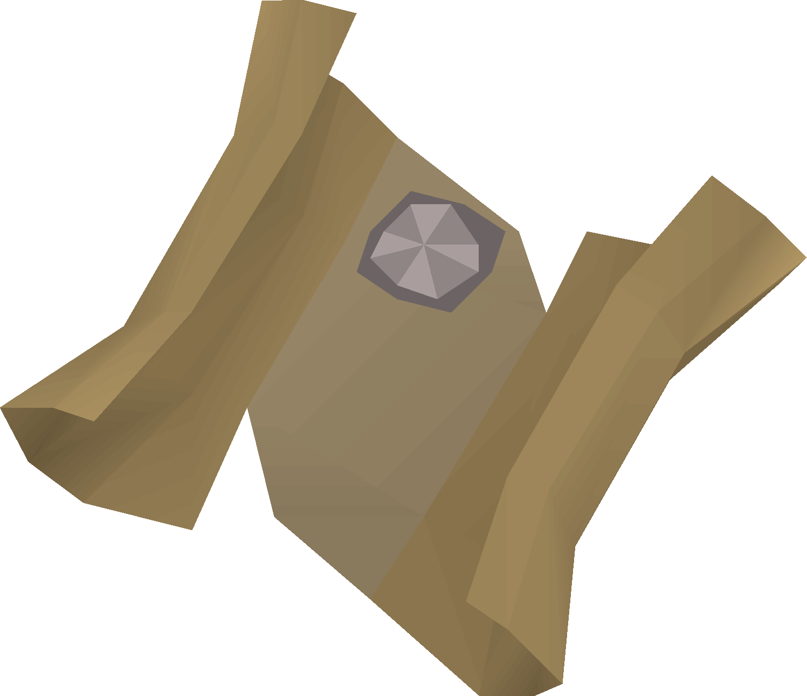

# Clue Tags

_Welcome to Clue Tags!_

## Item Tags

Allow you to see a custom text for each clue without having to open it

[Getting Started](item-tags/getting-started.md){ .md-button }

    <a href="item-tags/easy">
        

            
            Easy
        

    </a>
    <a href="item-tags/medium">
        

            
            Medium
        

    </a>
    <a href="item-tags/hard">
        

            
            Hard
        

    </a>
    <a href="item-tags/elite">
        

            
            Elite
        

    </a>

## Gear Tags

Bank Tag Layouts for recommended gear setups

[Getting Started](gear/getting-started.md){ .md-button }

    <a href="gear/beginner">
        

            
            Beginner
        

    </a>
    <a href="gear/easy">
        

            
            Easy
        

    </a>
    <a href="gear/medium">
        

            
            Medium
        

    </a>
    <a href="gear/hard">
        

            
            Hard
        

    </a>
    <a href="gear/elite">
         

           
            Elite
        

    </a>
    <a href="gear/master">
        

            
            Master
        

    </a>
    <a href="gear/mimic">
        

            
            Mimic
        

    </a>

