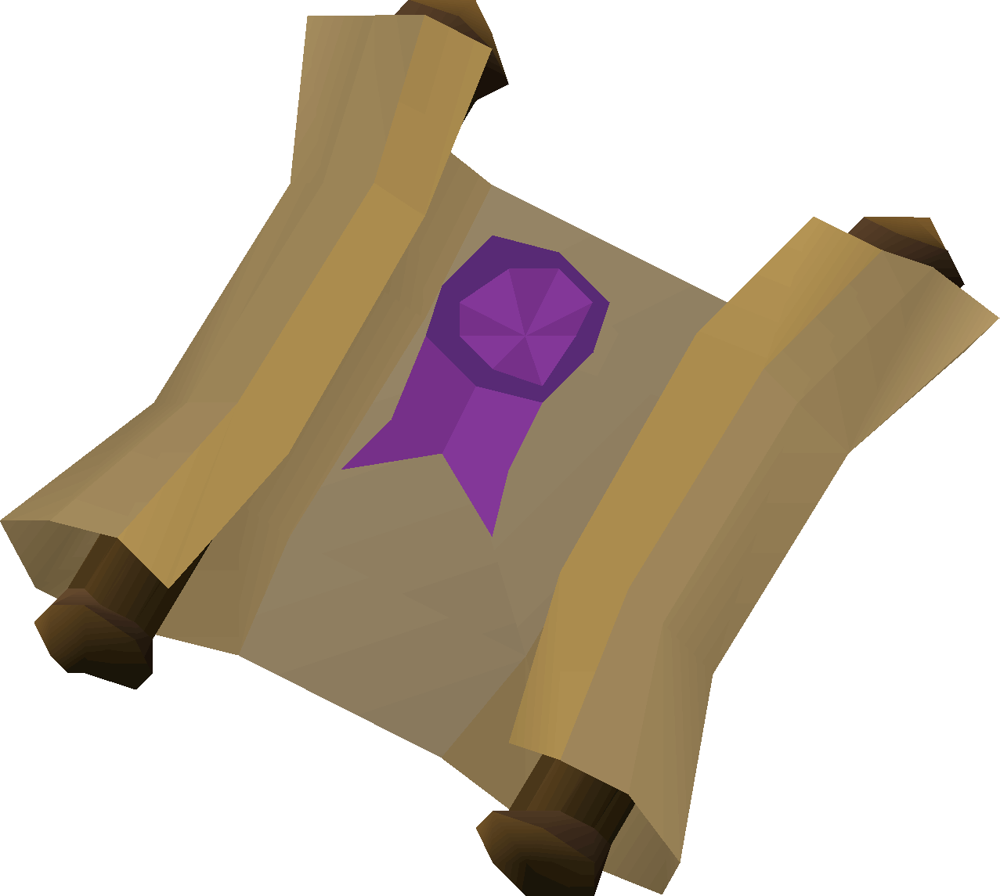

# Clue Tags

_Welcome to Clue Tags!_

## Item Tags

Allow you to see a custom text for each clue without having to open it

[Getting Started](item-tags/getting-started.md){ .md-button }

    

         
    

    

        
         
        <a href="item-tags/easy">Easy</a>
    

    

        
         
        <a href="item-tags/medium">Medium</a>
    

    

        
         
        <a href="item-tags/hard">Hard</a>
    

    

        
         
        <a href="item-tags/elite">Elite</a>
    

## Gear Tags

Bank Tag Layouts for recommended gear setups

[Getting Started](gear/getting-started.md){ .md-button }

    

        
         
        <a href="gear/beginner">Beginner</a>
    

    

        
         
        <a href="gear/easy">Easy</a>
    

    

        
         
        <a href="gear/medium">Medium</a>
    

    

        
         
        <a href="gear/hard">Hard</a>
    

    

        
         
        <a href="gear/elite">Elite</a>
    

        

        
         
        <a href="gear/Mmaster">Master</a>
    

    

        
         
        <a href="gear/mimic">Mimic</a>
    

