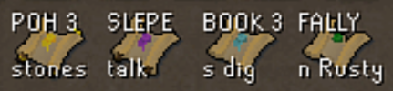

# Item Tags

All clue tiers **except beginner and master** have unique item IDs for each clue step

This allows us to provide hints on the clue scroll item **without requiring players to open the clue**

## How To

Requires the [Custom Item Tags](https://runelite.net/plugin-hub/show/custom-item-tags) RuneLite plugin

To import:

- Copy contents of one of the provided item tags to your clipboard
- Paste into the *Custom Tags* section in the plugin configuration

- **Note**: To use multiple sets of tags at once, paste the next set of tags on a **new line**

You should now see a tag on your clue item

## Tags

    {{ index_link('easy') }}
    {{ index_link('medium') }}
    {{ index_link('hard') }}
    {{ index_link('elite') }}

