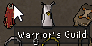

# :material-swap-horizontal: Custom Swaps

The Custom Menu Swaps plugin allows us to provide hotkey shortcuts for items with minimenus.

## How To

1. Requires the [Custom Menu Swaps](https://runelite.net/plugin-hub/show/hotkeyable-menu-swaps) RuneLite plugin
2. In the plugin configuration, edit *Custom Swaps (hotkeys)*
3. Copy text below into each of the *hotkey X* sections, where the title of the below tab matches the hotkey set

    _Copy button is provided on the right_

    === "1"
        ``` title=""
        --8<-- "docs/swaps/hotkeys/1.txt"
        ```
    === "2"
        ``` title=""
        --8<-- "docs/swaps/hotkeys/2.txt"
        ```
    === "3"
        ``` title=""
        --8<-- "docs/swaps/hotkeys/3.txt"
        ```
    === "4"
        ``` title=""
        --8<-- "docs/swaps/hotkeys/4.txt"
        ```
    === "5"
        ``` title=""
        --8<-- "docs/swaps/hotkeys/5.txt"
        ```
    === "6"
        ``` title=""
        --8<-- "docs/swaps/hotkeys/6.txt"
        ```
    === "7"
        ``` title=""
        --8<-- "docs/swaps/hotkeys/7.txt"
        ```
    === "8"
        ``` title=""
        --8<-- "docs/swaps/hotkeys/8.txt"
        ```
    === "9"
        ``` title=""
        --8<-- "docs/swaps/hotkeys/9.txt"
        ```
    === "A"
        ``` title=""
        --8<-- "docs/swaps/hotkeys/A.txt"
        ```
    === "B"
        ``` title=""
        --8<-- "docs/swaps/hotkeys/B.txt"
        ```
    === "C"
        ``` title=""
        --8<-- "docs/swaps/hotkeys/C.txt"
        ```
    === "D"
        ``` title=""
        --8<-- "docs/swaps/hotkeys/D.txt"
        ```
    === "E"
        ``` title=""
        --8<-- "docs/swaps/hotkeys/E.txt"
        ```
    === "F"
        ``` title=""
        --8<-- "docs/swaps/hotkeys/F.txt"
        ```
    === "G"
        ``` title=""
        --8<-- "docs/swaps/hotkeys/G.txt"
        ```
    === "H"
        ``` title=""
        --8<-- "docs/swaps/hotkeys/H.txt"
        ```
    === "I"
        ``` title=""
        --8<-- "docs/swaps/hotkeys/I.txt"
        ```
    === "J"
        ``` title=""
        --8<-- "docs/swaps/hotkeys/J.txt"
        ```


4. Holding the configured hotkey before clicking an item allows the player to skip the teleport menu/minimenu

    The below image shows the user holding the ```1``` hotkey with the Max cape

    - 
